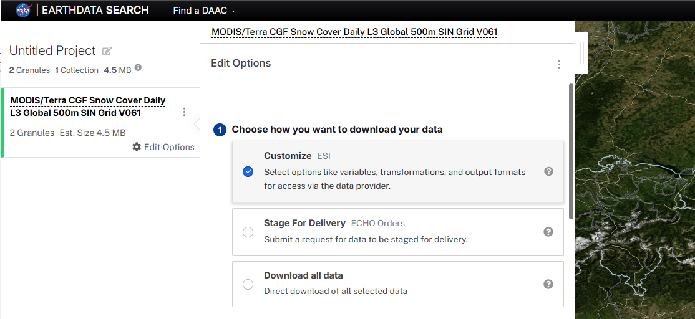
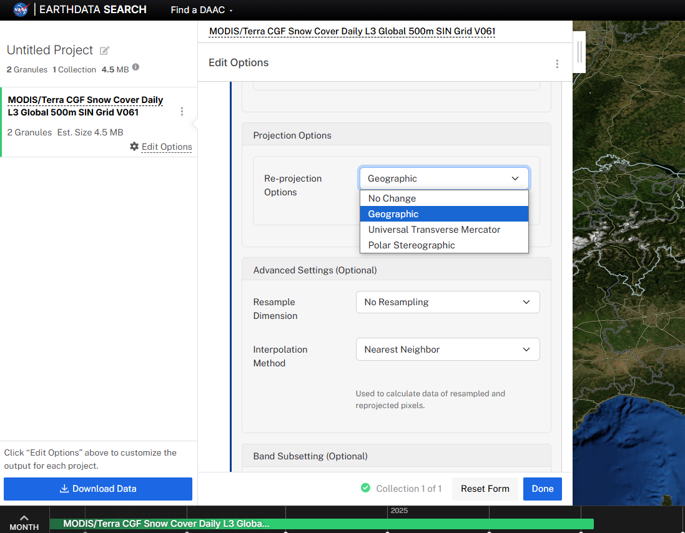

# Predicción de la cobertura de nieve con un modelo NARX

## Descripción

Este proyecto tiene como objetivo crear conciencia sobre cómo va a ir cambiando el nivel de la capa de nieve en fechas futuras utilizando un modelo NARX (Non-linear Autoregressive with Exogenous Inputs).

La funcionalidad de este código es tomar un modelo de red neuronal recurrente (RNN) que has entrenado para predecir 'area_nieve' basándose en valores pasados de sí misma y de otras variables (exógenas), y utilizar ese modelo para predecir valores futuros de 'area_nieve' más allá de los datos que se utilizaron para entrenar y evaluar el modelo

## Estructura de los datos

Los datos utilizados que usaré en este proyecto contienen los siguientes datasets de la nasa del satélite MOD10A1F:

* CGF_NDSI_Snow_Cover: **Este será el que nos interesa**
    - long_name: 'cloud-gap-filled NDSI snow cover',
    - valid_range: [0, 100],
    - FillValue: 255,
    - Key:
        - **40 - 100 = NIEVE (1)**

        - 0-100 = NDSI snow,
        - 200 = missing data,
        - 201 = no decision,
        - 211 = night,
        - 237 = inland water,
        - 239 = ocean,
        - 250 = cloud,
        - 254 = detector saturated,
        - 255 = fill

* Cloud_Persistence
    - long_name:
    - cloud persistence for preceding days,
    - valid_range: [0, 254],
    - FillValue: 255,
    - Key:
        - count of consecutive preceding days of cloud cover

Cada dataset es un raster de datos diviendo la basin en píxeles con los valores arriba mencionados, en este proyecto se considerarán los valores entre 40 y 100 como nieve, y los demás como no nieve para simplificar el modelo

# Estructura del Dataset CGF_NDSI_Snow_Cover _(snow_cover)_
Este es el Dataset con el que trabajaremos, se trata de un xarray que contiene datos de cubierta de nieve derivados de imagenes MODIS, su estructura principal es la siguiente:
* **Dimensiones:**
    * `y`: Coordenadas de latitud
    * `x`: Coordenadas de longitud
    Se puede acceder a las coordenadas de latitud con `snow_cover.y.values` y a las de longitud con `snow_cover.x.values`.
* **Variable principal:**
    * `CGF_NDSI_Snow_Cover`: Representa el Índice de Nieve de Diferencia Normalizada (NDSI), indicando la fracción de cubierta de nieve en cada píxel.
    Los valores de cubierta de nieve se acceden directamente a través de `snow_cover["CGF_NDSI_Snow_Cover"]`.

## 1. Obtención de Datos 

Los datos MODIS se obtuvieron de [EarthData Search](https://search.earthdata.nasa.gov/search), la plataforma de NASA para la búsqueda de datos geoespaciales. Los pasos para la descarga personalizada fueron los siguientes:

1.  **Filtrado por Fecha y Área de Interés:**
    * Se filtraron los datos por el rango de fechas deseado y se definió el área de interés correspondiente a la basin Adda-Bormio mediante un archivo .zip que contiene el .shp para delimitar el perímetro.

2.  **Descarga Personalizada:**
    * Se seleccionó la opción de descarga personalizada para tener control sobre el formato y la proyección de los datos.
        * 
3.  **Reproyección geoespacial (Latitud/Longitud):**
    * Se solicitó que los datos fueran re proyectados al sistema de coordenadas geográficas (latitud/longitud). Por defecto, los datos MODIS se proporcionan en proyección sinusoidal, que no es adecuada para muchos análisis comunes.
        * 
    * Es importante reproyectar los datos antes de la descarga para simplificar el procesamiento posterior.

    ## 🧠 Tipo de Modelo: NARX (Nonlinear AutoRegressive with eXogenous inputs)

Nuestro modelo se basa en la arquitectura **NARX (Nonlinear AutoRegressive with eXogenous inputs)**, que se implementa mediante **Redes Neuronales Recurrentes (RNN)** con **capas LSTM (Long Short-Term Memory)**.

## 2. Arquitectura del modelo

### ¿Qué es NARX?

**NARX** es una clase de modelos de series temporales que predice un valor futuro de una variable basándose en:
* **Auto-Regresivo (AR):** Valores pasados de la misma variable (en este caso, el área de nieve).
* **Variables Exógenas (X):** Valores pasados y/o presentes de otras variables externas que influyen en la variable objetivo. Para este proyecto, estas variables exógenas incluyen:
    * `temperatura`
    * `precipitacion`
    * `dias_sin_precip`
    * (`precipitacion_bool`, `year`, `month`) también presentes en los datos, en algunos modelos los incluiré y en otros no, para comprobar rendimiento y métricas
* **No Lineal (N):** Las relaciones entre las entradas y la salida no son lineales, lo que permite al modelo capturar dinámicas complejas. Las redes neuronales son la elección ideal para modelar estas relaciones no lineales.

### ¿Por qué LSTM?

Las **LSTM** son un tipo avanzado de capa de red neuronal recurrente. Su principal ventaja es su capacidad para aprender y recordar dependencias a largo plazo en secuencias de datos. Esto es crucial para la predicción de series temporales, donde el estado actual del sistema (área de nieve) puede depender de eventos que ocurrieron hace mucho tiempo. A diferencia de las RNN tradicionales, las LSTM superan el problema del "gradiente desvanecido" mediante "puertas" internas que controlan el flujo de información, permitiéndoles retener información relevante y descartar la irrelevante a lo largo de extensas secuencias.

### Arquitectura del Modelo Específico

Se entrena un modelo NARX-LSTM independiente para cada cuenca, lo que permite una especialización y adaptación a las características únicas de cada una. La arquitectura de cada modelo es la siguiente:

* **Capa de Entrada:** `input_shape = (n_lags_area, 1 + num_variables_exogenas)`
    * Recibe secuencias de longitud `n_lags_area` (ej. 3) de datos. Cada elemento de la secuencia es un vector que contiene el área de nieve escalada y las variables exógenas escaladas para un momento dado.
* **Capa LSTM:** `LSTM(n_units_lstm, activation='relu')` Una capa recurrente que procesa la secuencia de entrada. Aprende y extrae patrones temporales y relaciones no lineales. Se configura con 2 parámetros:
    *  n_units_lstm: numero de neuronas, cuanto mayor sea este número mayor capacidad para aprender patrones y relaciones complejas pero mayor coste computacional y mayor riesgo de 'overfitting'
    *  Funcion de activación, en este caso "relu" (Rectified Linear Unit): introduce no linealidad, permitiendo que la red aprenda y modele relaciones más complejas y no lineales en los datos.
* **Capa Densa de Salida:** Una capa totalmente conectada con una única neurona, que produce la predicción del área de nieve para el siguiente paso de tiempo ($t+1$).
    * `Dense(1)`

## 3. Preprocesamiento de los datos

En este apartado se juntarán todas las variables que nos intesan para nuestro modelo del apartado anterior y se analizará el dataset resultante, haremos lo siguiente:

1. EDA: exploracion de los datos
Lo primero será juntar los 2 csv creados anteriormente haciendo coincidir las fechas, el resultado será un dataframe de este estilo:
.png)

Este es el resultado de juntar los dos dataframes creados anteriormente, sin embargo añadiré una columna más para mejorar el modelo "dias_sin_precip" que contará los dias transcurridos desde la última precipitación

## 4. Distribución de ficheros
El proyecto se divide en 2 grandes partes: el disco externo y el directorio en el que se encuentra este mismo README

Dentro del disco externo habrá dos directorios:
- **data:** en el que se encontrarán todos los CSVs y los archivos hdf descargados
    ->
- **models:** en el que habrá una carpeta por cada cuenca que contendrá el mejor modelo para esa cuenca asi como sus métricas, y gráficas relevantes con respecto a las predicciones:
    - *future_predictions*: se mostrarán
    - *graphs_adda-bornio*
    - *metrics.json*
    - *narx_model_adda-bornio.h5*

## 5. Ficheros útiles

### 5.1. limpieza_datos.py
Este fichero contiene un conjunto de funciones útiles para procesar los datos y crear diferentes csv, a continuación se detallarán brevemente las funciones contenidas

- **process_basin(basin):** función principal que calcula el area de la cuenca *'basin'*. Procesa cada uno de los archivos hdfs y calcula el area de nieve, el resultado se guarda en *EXTERNAL_DISK/data/csv/areas/*
- **process_var_exog(input_file, output_path, save=False):** coge el excel de series agregadas y lo convierte a csv separándolo y renombrando las columnas. Devuelve un csv con todas las variables exógenas y con una nueva columna 'cuenca' que idenfica a qué cuenca pertenece cada registro.
- **cleaning_future_series(input_data_path, output_data_path):** función que procesa el excel *EXTERNAL_DISK:\data\csv\Series_historicas-futuras.xlsx* y crea un csv con las varibles exógenas para cada escenario y cada modelo, en total saldrán 20 csv distintos
- **join_area_exog(exog_file, areas_path, output_path = './datasets', save=False):** función para obtener el el dataset final de cada cuenca, coge como parámetro el csv de variables exógenas, el csv de areas calculado anteriormente y los junta, preparado para entrenar al modelo
- **impute_outliers(df, cuenca, columna, save=False):** función que coge un dataframe, y quita los outliers de la columna especificada por parámetro. Se considerará outlier cualquier valor por encima de *1.5 * rango_intercuartilico*

### 5.2. models/best_params.py
Programa muy útil que hace uso de la librería optuna y se encarga de encontrar el mejor modelo para cada cuenca. Simplemente ejecutar el script y se pedirá al usuario la cuenca que se desea optimizar y el número de ensayos que se quiere realizar. Cada ensayo tarda bastante por lo que se recomienda no usar un número demasiado alto, ej: 10-20.
Se creará un modelo .h5 con la mejor configuración, se plotearán las gráficas y se obtendrán las metricas en el directorio *EXTERNAL_DISK/new_models/*.
La métrica que se usa para la optimización es el NSE (Nash Sutcliffe Efficiency)

### 5.3. models/create_load_model.py
Una vez se conocen la mejor configuración, para un modelo, este script creará o evaluará un nuevo modelo y se crearán gráficas para mejor visualización. Al igual que el fichero anterior, simplemente se ejecuta y el programa se encargará de pedir los datos al usuario

### 5.4. models/predictions.py
Este script pide al usuario el nombre de una cuenca, y el escenario del que se desea obtener la predicciones: obtiene los datasets de variables exógenas de cada modelo para ese escenario y genera una gráfica en la que se visualizan las diferentes predicciones y un csv con las predcicciones de cada modelo.

### 5.5. heatmaps.py
Se encarga de generar los mapas de probabilidad de que cada pixel esté cubierno o no de nieve, leyendo los archivos hdf.
¿Como usar?
Simplemente llamar a la funcion, save = True para guardar los resultados o False simplemente para mostrarlos por pantalla 

### 5.6. environment-hdf.yml & tf210_gpu.yml
Entornos para que funcione el proyecto correctamente, tanto para heatmaps.py como para algunas funcionalidades de limpieza_datos.py es necesario tener activo el entorno *environment-hdf.yml*. Para el resto usaremos *tf210_gpu.py* ya que usará la versión 2.10 de TensorFlow (libreria para machine learning) y hará uso de la gpu (si el pc está configurado para ello) para procesar los datos más rapidamente.

## 📊 Evaluación del Modelo

El rendimiento del modelo se evalúa utilizando cuatro métricas clave en diferentes conjuntos de datos para proporcionar una visión completa de su capacidad:

* **R2 (Coeficiente de Determinación):** Mide la proporción de la varianza en la variable dependiente que es predecible a partir de las variables independientes. Un valor cercano a 1.0 indica un buen ajuste.
* **MAE (Error Absoluto Medio):** Calcula la media de las diferencias absolutas entre las predicciones y los valores reales. Se expresa en las mismas unidades que la variable objetivo, facilitando su interpretación.
* **NSE (Eficiencia de Nash-Sutcliffe):** Una métrica hidrológica que evalúa qué tan bien las predicciones se ajustan a las observaciones. Un NSE de 1.0 indica un ajuste perfecto, mientras que valores negativos sugieren que el modelo es peor que usar la media de las observaciones.
* **KGE (Eficiencia de Kling-Gupta):** Mejora el NSE al considerar la correlación, la varianza relativa y la sesgo relativo entre las predicciones y las observaciones. Un KGE de 1.0 es el valor óptimo.

### Conjuntos de Evaluación

1.  **Métricas de Entrenamiento:**
    * **Dónde:** Calculadas sobre el `conjunto de entrenamiento`.
    * **Propósito:** Indican qué tan bien el modelo ha aprendido los patrones de los datos utilizados para su optimización. Un buen rendimiento es esencial, pero un rendimiento excesivamente alto puede indicar sobreajuste.

2.  **Métricas de Prueba:**
    * **Dónde:** Calculadas sobre el `conjunto de prueba`.
    * **Propósito:** Evalúan la capacidad de generalización del modelo en datos **nunca antes vistos** durante el entrenamiento. Son la medida más honesta del rendimiento del modelo fuera del proceso de aprendizaje.

3.  **Métricas de Validación (Predicción Paso a Paso):**
    * **Dónde:** Calculadas sobre el `conjunto de validación`.
    * **Propósito:** Simulan un escenario de predicción futura real. El modelo utiliza los `n_lags_area` datos históricos iniciales y, a partir de ahí, usa sus **propias predicciones anteriores** como entrada para los pasos subsiguientes, junto con los valores reales futuros de las variables exógenas.
    * **Importancia:** Revela la robustez del modelo y cómo se acumulan los errores de predicción a lo largo del tiempo. Las métricas aquí suelen ser las más bajas debido a la propagación de errores, lo cual es un comportamiento esperado.

4.  **Métricas en Todo el Conjunto de Datos:**
    * **Dónde:** Calculadas combinando las predicciones y valores reales de los `conjuntos de entrenamiento`, `prueba` y `validación`.
    * **Propósito:** Proporciona una visión global del rendimiento del modelo a lo largo de todo el período de datos disponibles, ofreciendo un resumen consolidado en modo predicción.
