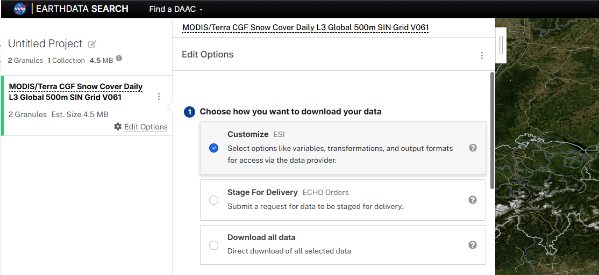
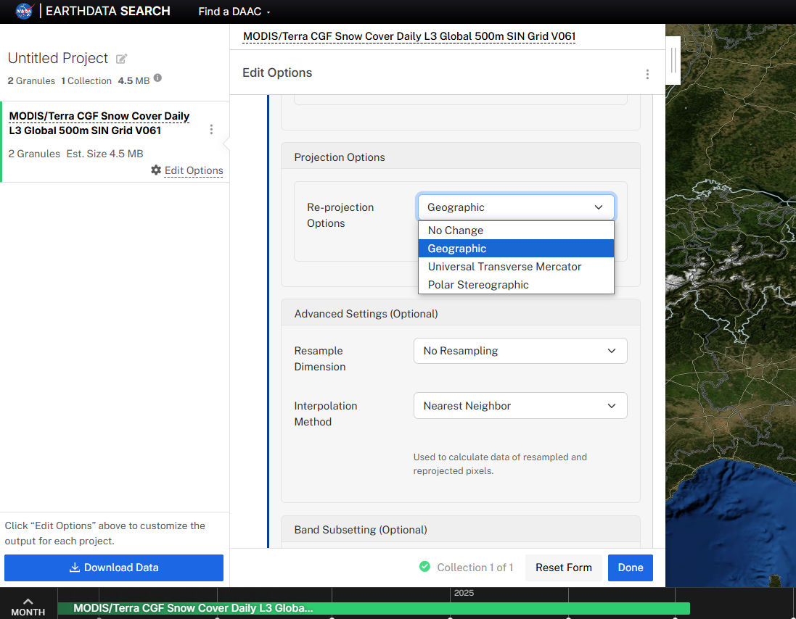
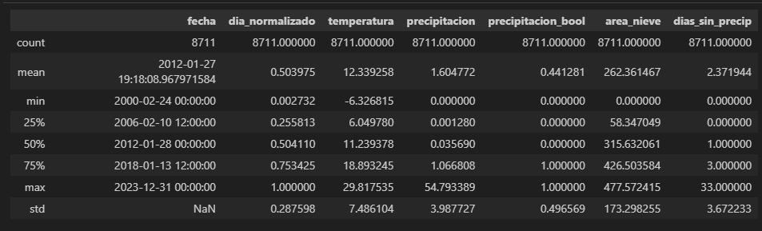
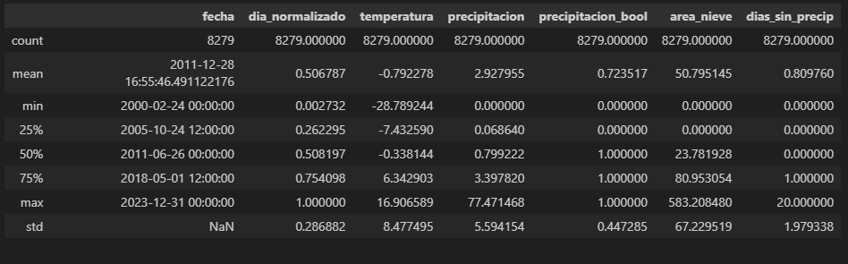
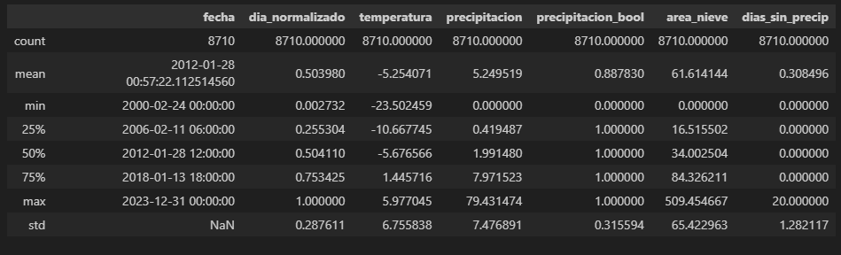
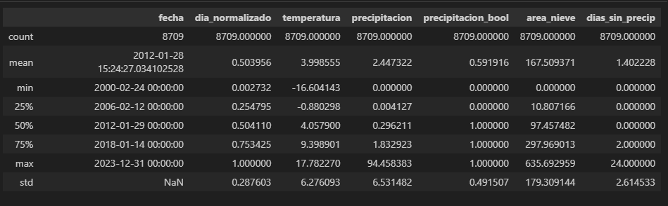
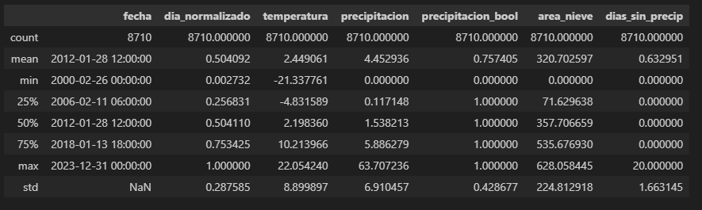
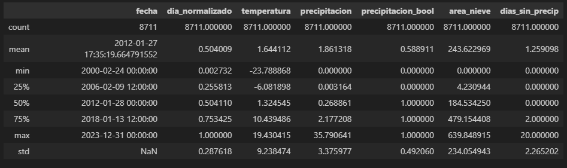

# Predicción de la cobertura de nieve con un modelo NARX

## Descripción

Este proyecto tiene como objetivo crear conciencia sobre cómo va a ir cambiando el nivel de la capa de nieve en fechas futuras utilizando un modelo NARX (Non-linear Autoregressive with Exogenous Inputs).

Ésta es solo una parte del proyecto, yo me centraré en el uso de la inteligencia artificial con redes neuronales autoregresivas para evaluar el impacto del cambio climático en la cobertura de nieve.

## Estructura de los datos

Los datos utilizados que usaré en este proyecto contienen los siguientes datasets de la NASA:

* CGF_NDSI_Snow_Cover: **Este será el que nos interesa**
    - long_name: 'cloud-gap-filled NDSI snow cover',
    - valid_range: [0, 100],
    - FillValue: 255,
    - Key:
        - **40 - 100 = NIEVE (1)**

        - 0-100 = NDSI snow,
        - 200 = missing data,
        - 201 = no decision,
        - 211 = night,
        - 237 = inland water,
        - 239 = ocean,
        - 250 = cloud,
        - 254 = detector saturated,
        - 255 = fill

* Cloud_Persistence
    - long_name:
    - cloud persistence for preceding days,
    - valid_range: [0, 254],
    - FillValue: 255,
    - Key:
        - count of consecutive preceding days of cloud cover

Cada dataset es un raster de datos diviendo la cuenca en píxeles con los valores arriba mencionados, yo consideraré  los valores entre 40 y 100 como nieve, y los demás como no nieve para simplificar el modelo

# Estructura del Dataset CGF_NDSI_Snow_Cover _(snow_cover)_
Este es el Dataset con el que trabajaremos, se trata de un xarray que contiene datos de cubierta de nieve derivados de imagenes MODIS, su estructura principal es la siguiente:
* **Dimensiones:**
    * `y`: Coordenadas de latitud
    * `x`: Coordenadas de longitud
    Se puede acceder a las coordenadas de latitud con `snow_cover.y.values` y a las de longitud con `snow_cover.x.values`.
* **Variable principal:**
    * `CGF_NDSI_Snow_Cover`: Representa el Índice de Nieve de Diferencia Normalizada (NDSI), indicando la fracción de cubierta de nieve en cada píxel.
    Los valores de cubierta de nieve se acceden directamente a través de `snow_cover["CGF_NDSI_Snow_Cover"]`.

## 1. Obtención de Datos

Los datos MODIS se obtuvieron de [EarthData Search](https://search.earthdata.nasa.gov/search), la plataforma de NASA para la búsqueda de datos geoespaciales. Los pasos para la descarga personalizada fueron los siguientes:

1.  **Filtrado por Fecha y Área de Interés:**
    * Se filtraron los datos por el rango de fechas deseado y se definió el área de interés correspondiente a la cuenca Adda-Bormio.

2.  **Descarga Personalizada:**
    * Se seleccionó la opción de descarga personalizada para tener control sobre el formato y la proyección de los datos.
        * 
3.  **Reproyección geoespacial (Latitud/Longitud):**
    * Se solicitó que los datos fueran re proyectados al sistema de coordenadas geográficas (latitud/longitud). Por defecto, los datos MODIS se proporcionan en proyección sinusoidal, que no es adecuada para muchos análisis comunes.
        * 
    * Es importante reproyectar los datos antes de la descarga para simplificar el procesamiento posterior.

## 2. Limpieza de datos

Este apartado se centrará en leer tanto los archivos hdf descargados previamente como las series históricas agregadas y guardarlos en csv para su posterior procesamiento

1. Lectura de datos necesarios de archivos hdf
2. Cálculo del área de nieve para cada día y guardarlo en un csv con estas 2 columnas (fecha y area_nieve)
3. Lectura las series históricas agregadas: variables de temperatura y precipitación
4. Limpiar y normalizar los datos sobre las series agregadas: correción de formato, eliminación de columnas innecesarias, agregas columnas faltantes, etc...
5. Separar estas series agregadas en 6 csv (uno por cada cuenca)

## 3. Preprocesamiento de los datos

En este apartado se juntarán todas las variables que nos intesan para nuestro modelo del apartado anterior y se analizará el dataset resultante, haremos lo siguiente:

1. EDA: exploracion de los datos
Lo primero será juntar los 2 csv creados anteriormente haciendo coincidir las fechas, el resultado será un dataframe de este estilo:
.png)

Este es el resultado de juntar los dos dataframes creados anteriormente, sin embargo añadiré una columna más para mejorar el modelo "dias_sin_precip" que contará los dias transcurridos desde la última precipitación

Ahora exploraremos cada variable para ver como se comporta:
# adda-bornio

* **dia_normalizado:** Esta columna, ya normalizada entre 0 y 1, tiene una media cercana a 0.5, lo que sugiere una distribución uniforme de los días a lo largo del periodo analizado para el modelo autoregresivo.
* **temperatura:** La temperatura media diaria en la cuenca se sitúa en torno a los 12.34 grados Celsius, con un rango que va desde valores bajo cero (-6.33 °C) hasta máximos de casi 30 °C. La desviación estándar de 7.49 °C indica una variabilidad considerable en la temperatura diaria.
* **precipitacion:** La precipitación media diaria es de aproximadamente 1.60 litros por metro cuadrado, con días sin lluvia (mínimo de 0) y días de lluvia intensa (máximo de 54.79 l/m²). La desviación estándar de 3.99 l/m² señala una alta variabilidad en la cantidad de precipitación.
* **precipitacion_bool:** Esta variable binaria indica que llovió en aproximadamente el 44.13% de los días (media de 0.4413).
* **area_nieve:** La superficie media cubierta por nieve es de unos 262.36 km², con una gran variabilidad (desviación estándar de 173.30 km²). Hay días sin nieve (mínimo de 0) y días con una extensa cobertura (máximo de 477.57 km²). El percentil 25% muestra una cobertura relativamente baja, mientras que el 75% indica una cobertura más significativa.
* **dias_sin_precip:** De media, han transcurrido alrededor de 2.37 días desde la última precipitación. El valor máximo de 33 días sugiere periodos secos prolongados, mientras que el percentil 25% indica que en muchos casos no ha pasado ningún día desde la última lluvia.

# genil-dilar

# indrawati-melamchi

# machopo-almendros

# nenskra-enguri

# uncompahgre-ridgway

2. Data cleaning: Limpiar datos en blanco, así como detectar outliers y errores lógicos de información
3. Visualización
4. Pre-procesing

