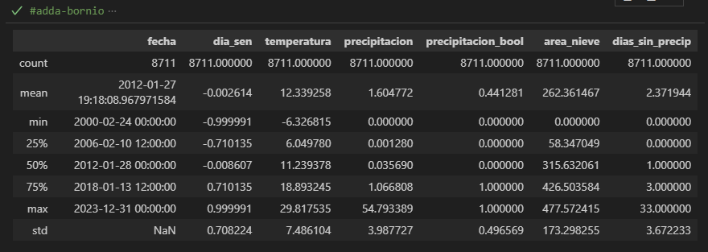
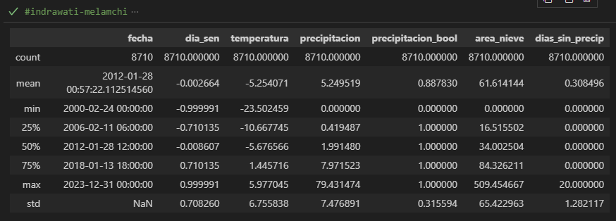
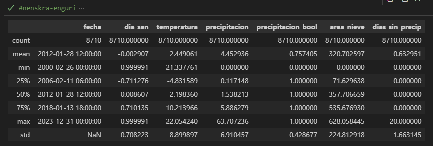

# Predicción de la cobertura de nieve con un modelo NARX

## Descripción

Este proyecto tiene como objetivo crear conciencia sobre cómo va a ir cambiando el nivel de la capa de nieve en fechas futuras utilizando un modelo NARX (Non-linear Autoregressive with Exogenous Inputs).

La funcionalidad de este código es tomar un modelo de red neuronal recurrente (RNN) que has entrenado para predecir 'area_nieve' basándose en valores pasados de sí misma y de otras variables (exógenas), y utilizar ese modelo para predecir valores futuros de 'area_nieve' más allá de los datos que se utilizaron para entrenar y evaluar el modelo

## Estructura de los datos

Los datos utilizados que usaré en este proyecto contienen los siguientes datasets de la NASA:

* CGF_NDSI_Snow_Cover: **Este será el que nos interesa**
    - long_name: 'cloud-gap-filled NDSI snow cover',
    - valid_range: [0, 100],
    - FillValue: 255,
    - Key:
        - **40 - 100 = NIEVE (1)**

        - 0-100 = NDSI snow,
        - 200 = missing data,
        - 201 = no decision,
        - 211 = night,
        - 237 = inland water,
        - 239 = ocean,
        - 250 = cloud,
        - 254 = detector saturated,
        - 255 = fill

* Cloud_Persistence
    - long_name:
    - cloud persistence for preceding days,
    - valid_range: [0, 254],
    - FillValue: 255,
    - Key:
        - count of consecutive preceding days of cloud cover

Cada dataset es un raster de datos diviendo la basin en píxeles con los valores arriba mencionados, yo consideraré  los valores entre 40 y 100 como nieve, y los demás como no nieve para simplificar el modelo

# Estructura del Dataset CGF_NDSI_Snow_Cover _(snow_cover)_
Este es el Dataset con el que trabajaremos, se trata de un xarray que contiene datos de cubierta de nieve derivados de imagenes MODIS, su estructura principal es la siguiente:
* **Dimensiones:**
    * `y`: Coordenadas de latitud
    * `x`: Coordenadas de longitud
    Se puede acceder a las coordenadas de latitud con `snow_cover.y.values` y a las de longitud con `snow_cover.x.values`.
* **Variable principal:**
    * `CGF_NDSI_Snow_Cover`: Representa el Índice de Nieve de Diferencia Normalizada (NDSI), indicando la fracción de cubierta de nieve en cada píxel.
    Los valores de cubierta de nieve se acceden directamente a través de `snow_cover["CGF_NDSI_Snow_Cover"]`.

## 1. Obtención de Datos

Los datos MODIS se obtuvieron de [EarthData Search](https://search.earthdata.nasa.gov/search), la plataforma de NASA para la búsqueda de datos geoespaciales. Los pasos para la descarga personalizada fueron los siguientes:

1.  **Filtrado por Fecha y Área de Interés:**
    * Se filtraron los datos por el rango de fechas deseado y se definió el área de interés correspondiente a la basin Adda-Bormio.

2.  **Descarga Personalizada:**
    * Se seleccionó la opción de descarga personalizada para tener control sobre el formato y la proyección de los datos.
        * 
3.  **Reproyección geoespacial (Latitud/Longitud):**
    * Se solicitó que los datos fueran re proyectados al sistema de coordenadas geográficas (latitud/longitud). Por defecto, los datos MODIS se proporcionan en proyección sinusoidal, que no es adecuada para muchos análisis comunes.
        * 
    * Es importante reproyectar los datos antes de la descarga para simplificar el procesamiento posterior.

## 2. Limpieza de datos

Este apartado se centrará en leer tanto los archivos hdf descargados previamente como las series históricas agregadas y guardarlos en csv para su posterior procesamiento

1. Lectura de datos necesarios de archivos hdf
2. Cálculo del área de nieve para cada día y guardarlo en un csv con estas 2 columnas (fecha y area_nieve)
3. Lectura las series históricas agregadas: variables de temperatura y precipitación
4. Limpiar y normalizar los datos sobre las series agregadas: correción de formato, eliminación de columnas innecesarias, agregas columnas faltantes, etc...
5. Separar estas series agregadas en 6 csv (uno por cada basin)

## 3. Preprocesamiento de los datos

En este apartado se juntarán todas las variables que nos intesan para nuestro modelo del apartado anterior y se analizará el dataset resultante, haremos lo siguiente:

1. EDA: exploracion de los datos
Lo primero será juntar los 2 csv creados anteriormente haciendo coincidir las fechas, el resultado será un dataframe de este estilo:
.png)

Este es el resultado de juntar los dos dataframes creados anteriormente, sin embargo añadiré una columna más para mejorar el modelo "dias_sin_precip" que contará los dias transcurridos desde la última precipitación

Ahora exploraremos cada variable para ver como se comporta:
# adda-bornio

Este DataFrame contiene datos diarios para la basin "genil-dilar" a lo largo de varios años.

- **dia_sen:** Variable temporal normalizada utilizando la función seno. El valor medio es cercano a cero (-0.0026), con un rango que abarca desde -0.9999 hasta 0.9999, indicando la representación cíclica del año. La desviación estándar (0.7082) sugiere una dispersión considerable a lo largo del ciclo anual.

- **temperatura:** La temperatura media diaria presenta una media de 12.34 °C, con valores que oscilan entre un mínimo de -6.33 °C y un máximo de 29.82 °C. La desviación estándar de 7.49 °C indica una variabilidad significativa en la temperatura diaria.

- **precipitacion:** La precipitación diaria tiene una media de 1.60 litros/m², con un valor mínimo de 0 y un máximo de 54.79 litros/m². La desviación estándar de 3.99 litros/m² muestra una alta variabilidad en la cantidad de precipitación.

- **precipitacion_bool:** Variable binaria que indica la presencia (1) o ausencia (0) de precipitación. De media, llueve aproximadamente el 44% de los días.

- **area_nieve:** El área cubierta por nieve tiene una media de 262.36 km², con un rango que va desde 0 km² hasta un máximo de 477.57 km². La desviación estándar de 173.30 km² revela una gran variabilidad en la extensión de la capa de nieve.

- **dias_sin_precip:** El número de días transcurridos desde la última precipitación tiene una media de 2.37 días, con un máximo de 33 días sin lluvia registrada. La desviación estándar de 3.67 días indica una variabilidad en la frecuencia de las precipitaciones.

# genil-dilar

Este DataFrame contiene datos diarios para la basin "adda-bornio" a lo largo de varios años.

- **dia_sen:** Similar a otras basins, esta variable temporal normalizada con la función seno tiene una media cercana a cero (-0.0088) y un rango completo de -0.9999 a 0.9999. La desviación estándar es de 0.7076.

- **temperatura:** La temperatura media diaria es de -0.79 °C, notablemente más baja que en la basin anterior. Los valores varían desde un mínimo extremo de -28.79 °C hasta un máximo de 16.91 °C. La desviación estándar de 8.48 °C indica una considerable variabilidad térmica.

- **precipitacion:** La precipitación diaria tiene una media de 2.93 litros/m², con un máximo registrado de 77.47 litros/m². La desviación estándar es de 5.59 litros/m².

- **precipitacion_bool:** La probabilidad de precipitación diaria es mayor en esta basin, con una media de 0.72, lo que indica que llueve aproximadamente el 72% de los días.

- **area_nieve:** El área de nieve presenta una media de 50.80 km², significativamente menor que en la basin "adda-bornio". El área varía desde 0 km² hasta un máximo de 583.21 km². La desviación estándar es de 67.23 km².

- **dias_sin_precip:** El promedio de días sin precipitación es bajo, de 0.81 días, con un máximo de 20 días consecutivos sin lluvia. La desviación estándar es de 1.98 días, lo que sugiere precipitaciones más frecuentes en comparación con la basin anterior.

# indrawati-melamchi

Este DataFrame contiene datos diarios para la basin "indrawati-melamchi" a lo largo de varios años.

- **dia_sen:** La variable temporal normalizada con la función seno tiene una media cercana a cero (-0.0027) y un rango completo de -0.9999 a 0.9999. La desviación estándar es de 0.7083.

- **temperatura:** La temperatura media diaria es de -5.25 °C, similar a la basin "genil-dilar" y también más baja que la "adda-bornio". Los valores oscilan entre un mínimo de -23.50 °C y un máximo de 5.98 °C. La desviación estándar de 6.76 °C indica una variabilidad considerable.

- **precipitacion:** La precipitación diaria presenta una media de 5.25 litros/m², con un máximo registrado de 79.43 litros/m². La desviación estándar es de 7.48 litros/m², mostrando una alta variabilidad.

- **precipitacion_bool:** La presencia de precipitación es muy frecuente en esta basin, con una media de 0.89, lo que sugiere que llueve aproximadamente el 89% de los días.

- **area_nieve:** El área cubierta por nieve tiene una media de 61.61 km², con un rango de 0 km² hasta un máximo de 509.45 km². La desviación estándar de 65.42 km² indica una variabilidad notable en la extensión de la nieve.

- **dias_sin_precip:** El número de días sin precipitación es muy bajo, con una media de 0.31 días y un máximo de 20 días consecutivos sin lluvia. La desviación estándar de 1.28 días sugiere precipitaciones muy frecuentes.

# mapocho-almendros

Este DataFrame contiene datos diarios para la basin "mapocho-almendros" a lo largo de varios años.

- **dia_sen:** La variable temporal normalizada con la función seno presenta una media cercana a cero (-0.0027) y un rango completo de -0.9999 a 0.9999. La desviación estándar es de 0.7084.

- **temperatura:** La temperatura media diaria es de 4.00 °C, ubicándose entre las temperaturas medias de las basins anteriores. Los valores varían desde un mínimo de -16.60 °C hasta un máximo de 17.78 °C. La desviación estándar de 6.28 °C indica una variabilidad térmica considerable.

- **precipitacion:** La precipitación diaria tiene una media de 2.45 litros/m², con un máximo registrado de 94.46 litros/m². La desviación estándar es de 6.53 litros/m², mostrando una alta variabilidad.

- **precipitacion_bool:** La probabilidad de precipitación diaria es de aproximadamente el 59%, con una media de 0.59.

- **area_nieve:** El área cubierta por nieve tiene una media de 167.51 km², con un rango que va desde 0 km² hasta un máximo de 635.69 km². La desviación estándar de 179.31 km² revela una gran variabilidad en la extensión de la capa de nieve.

- **dias_sin_precip:** El promedio de días sin precipitación es de 1.40 días, con un máximo de 24 días consecutivos sin lluvia. La desviación estándar es de 2.61 días.

# nenskra-enguri

Este DataFrame contiene datos diarios para la basin "nenskra-enguri" a lo largo de varios años.

- **dia_sen:** La variable temporal normalizada con la función seno tiene una media cercana a cero (-0.0030) y un rango completo de -0.9999 a 0.9999. La desviación estándar es de 0.7082.

- **temperatura:** La temperatura media diaria es de 2.45 °C, similar a la basin "mapocho-almendros". Los valores oscilan entre un mínimo de -21.34 °C y un máximo de 22.05 °C. La desviación estándar de 8.90 °C indica una variabilidad térmica considerable.

- **precipitacion:** La precipitación diaria presenta una media de 4.45 litros/m², con un máximo registrado de 63.71 litros/m². La desviación estándar es de 6.91 litros/m², mostrando una alta variabilidad.

- **precipitacion_bool:** La presencia de precipitación es frecuente en esta basin, con una media de 0.76, lo que sugiere que llueve aproximadamente el 76% de los días.

- **area_nieve:** El área cubierta por nieve tiene una media de 320.70 km², con un rango de 0 km² hasta un máximo de 628.06 km². La desviación estándar de 224.81 km² revela una gran variabilidad en la extensión de la capa de nieve.

- **dias_sin_precip:** El número de días sin precipitación es bajo, con una media de 0.63 días y un máximo de 20 días consecutivos sin lluvia. La desviación estándar de 1.66 días sugiere precipitaciones frecuentes.

# uncompahgre-ridgway

Este DataFrame contiene datos diarios para la basin "uncompahgre-ridgway" a lo largo de varios años.

- **dia_sen:** La variable temporal normalizada con la función seno tiene una media cercana a cero (-0.0027) y un rango completo de -0.9999 a 0.9999. La desviación estándar es de 0.7083.

- **temperatura:** La temperatura media diaria es de 1.64 °C. Los valores varían desde un mínimo de -23.79 °C hasta un máximo de 19.43 °C. La desviación estándar de 9.24 °C indica una variabilidad térmica considerable.

- **precipitacion:** La precipitación diaria presenta una media de 1.86 litros/m², con un máximo registrado de 35.79 litros/m². La desviación estándar es de 3.38 litros/m², mostrando una variabilidad moderada.

- **precipitacion_bool:** La probabilidad de precipitación diaria es de aproximadamente el 59%, con una media de 0.59.

- **area_nieve:** El área cubierta por nieve tiene una media de 243.62 km², con un rango que va desde 0 km² hasta un máximo de 639.85 km². La desviación estándar de 234.05 km² revela una gran variabilidad en la extensión de la capa de nieve.

- **dias_sin_precip:** El promedio de días sin precipitación es de 1.26 días, con un máximo de 20 días consecutivos sin lluvia. La desviación estándar es de 2.27 días.

2. Data cleaning: Limpiar datos en blanco, así como detectar outliers y errores lógicos de información
3. Visualización
4. Pre-procesing

-------------- Métricas en el conjunto de prueba modelo lstm (Predicción Directa) ---------------
R2 (Directa): 0.7156
MAE (Directa): 86.2435
NSE (Directa): 0.7156
KGE (Directa): 0.5182

Para predecir el área de nieve en el día t+1:

Las entradas al modelo serán:
Las predicciones del área de nieve en los días t,t−1,t−2,...,t−n (donde n es el número de lags).
Los valores reales de las variables exógenas para el día t+1.
Para predecir el área de nieve en el día t+2:

Las entradas al modelo serán:
La predicción del área de nieve para el día t+1.
La predicción del área de nieve para los días t,t−1,...,t−(n−1).
Los valores reales de las variables exógenas para el día t+2.
Y así sucesivamente.

Esquema de la predicción iterativa en el conjunto de validación:

Selecciona la última ventana de n_lags_area datos del conjunto de entrenamiento (escalados) como el historial inicial.
Itera sobre el número de pasos que deseas predecir en el conjunto de validación iterativa.
En cada paso:
Toma la ventana de historial actual y los valores correspondientes de las variables exógenas del conjunto de validación iterativa.
Realiza la predicción con el modelo.
Desescala la predicción del área de nieve.
Almacena esta predicción.
Actualiza la ventana de historial: elimina el valor más antiguo y añade la predicción actual (escalada).

METRICAS CON Random Forest:
- Evaluación en el conjunto de prueba (predicción directa):
    R2: 0.9467, MAE: 28.7578, NSE: 0.9467, KGE: 0.9404
- Evaluación en el conjunto de validación iterativa (modo predictivo):
    R2: 0.1556, MAE: 173.3554, NSE: 0.1556, KGE: 0.2602
- Métricas en todo el conjunto de datos (modo predictivo):
    R2: -0.5581, MAE: 177.8610, NSE: -0.5581, KGE: 0.0190

NUEVO MODELO NARX con capas LSTM(Long Short-Term Memory) de la libreria Keras (que se ejecuta sobre TensorFlow)
    - El LSTM es un tipo de capa de red neuronal recurrente
    - Para cada paspo en el tiempo, el modelo recibe como entrada una secuencia de los n_lags_area valores pasados del area de nieve
    - La capa LSTM procesa esta secuencia de entrada, aprendiendo las relaciones temporales entre el área de nieve pasada y las variables exógenas pasadas para entender cómo influyen en el valor futuro del área de nieve.
    